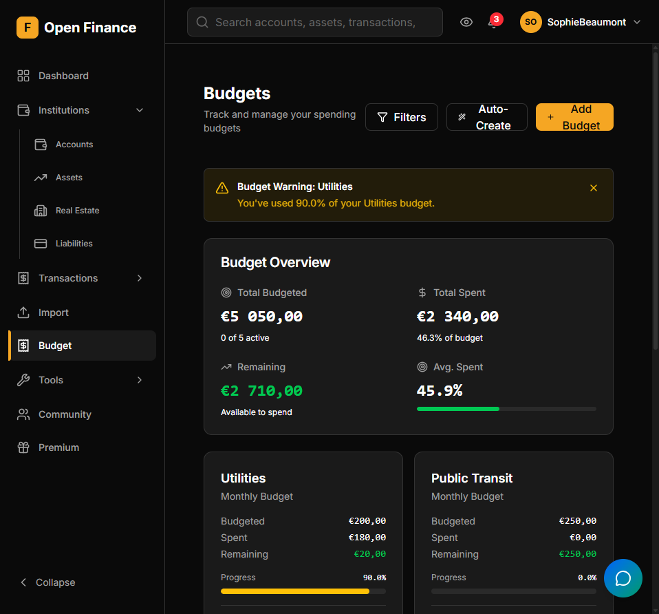

# Budgets

← [Wiki Home](HOME.md)

---

## Overview

Budgets set spending (or income) targets per category for a given time period. Open-Finance tracks your actual spending against each budget in real time, shows sub-period breakdowns, and sends warnings via [Budget Alerts](budget-alerts.md).

---

## Budget Periods

| Period    | Description                                     |
| --------- | ----------------------------------------------- |
| Monthly   | Resets on the first of each month               |
| Quarterly | Covers a calendar quarter (Jan–Mar, Apr–Jun, …) |
| Annual    | Covers a full calendar year                     |

---

## Creating a Budget

Go to **Budgets → New Budget** and fill in:

| Field    | Notes                                |
| -------- | ------------------------------------ |
| Category | One category per budget              |
| Amount   | Your target spending or income limit |
| Period   | Monthly, quarterly, or annual        |
| Currency | Defaults to your base currency       |

You can also create multiple budgets at once using the bulk creation option.

---

## Progress Tracking

Open-Finance shows live progress for each budget:

| What you see    | What it means                    |
| --------------- | -------------------------------- |
| Target amount   | Your budgeted limit              |
| Spent so far    | Actual spending in the period    |
| Remaining       | How much budget is left          |
| % used          | Progress toward the limit        |
| Days remaining  | Days left in the current period  |
| Projected total | Estimated spend by end of period |
| Status          | On Track, At Risk, or Exceeded   |

---

## Spending History

Each budget’s detail view shows a chart breaking the period into sub-periods (e.g., weeks for a monthly budget) so you can see how your spending evolved over time.

---

## Budget Summary

The dashboard includes a monthly overview widget showing all your budgets and their current progress at a glance.

---

## Auto-Suggestions

When creating a new budget, Open-Finance analyses your last 3 months of spending per category and suggests a realistic budget amount. The form is pre-filled with these values so you can adjust as needed.

---

## Related Pages

- [Budget Alerts](budget-alerts.md)
- [Categories](categories.md)
- [Notifications](notifications.md)
- [Dashboard](dashboard.md)
