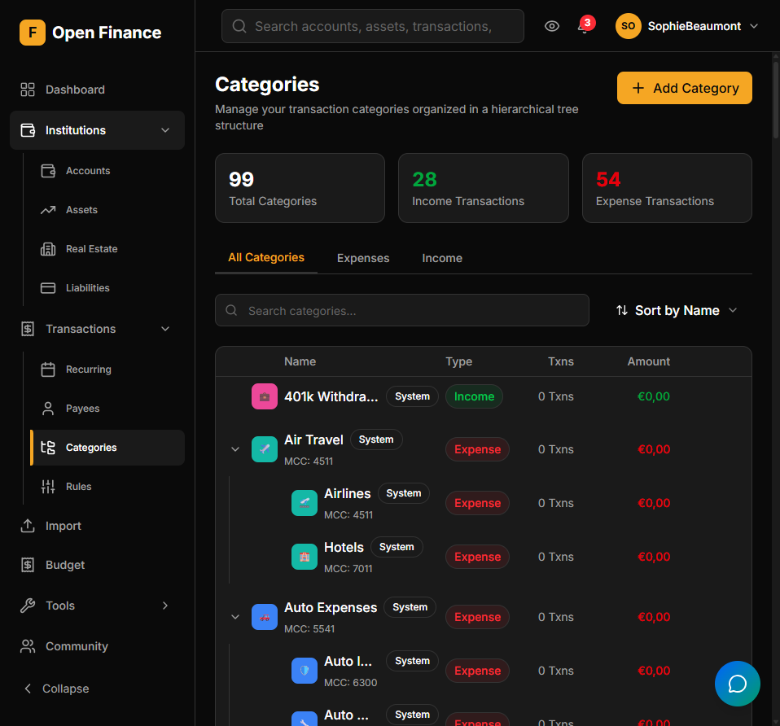

# Categories

← [Wiki Home](HOME.md)

---

## Overview

Categories classify your transactions into meaningful groups — Groceries, Utilities, Salary, Health, etc. They power budget tracking, spending breakdowns, insights, and reports.



---

## Category Types

| Type    | Description                                           |
| ------- | ----------------------------------------------------- |
| Income  | Revenue categories (salary, dividends, rental income) |
| Expense | Spending categories (food, transport, utilities)      |

---

## Hierarchy

Categories support a **parent–child hierarchy**. For example:

```
Food & Drink
├── Groceries
├── Restaurants
└── Coffee
```

Parent categories aggregate the totals of all their children in budget summaries and spending breakdowns.

---

## MCC Codes

Each category can be associated with a **Merchant Category Code (MCC)** — the 4-digit code banks use to classify merchants. When importing OFX/QFX files, Open-Finance maps MCC codes to your categories automatically.

---

## Auto-Categorization

Categories are assigned automatically through two mechanisms:

1. **Transaction Rules Engine** — user-defined rules that match on description, payee, amount, and more. See [Transaction Rules](transaction-rules.md).
2. **Payee category defaults** — each payee can have a default category; new transactions matched to that payee inherit it. See [Payees](payees.md).

---

## Localization

Built-in category names are available in both English and French, automatically displayed in your chosen language.

---

## Related Pages

- [Transactions](transactions.md)
- [Transaction Rules](transaction-rules.md)
- [Payees](payees.md)
- [Budgets](budgets.md)
