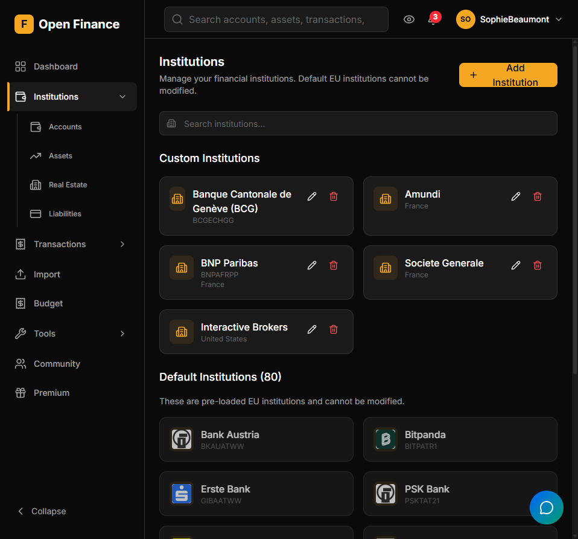

# Financial Institutions

← [Wiki Home](HOME.md)

---

## Overview

The institution registry lets you track and group accounts by their real-world financial institution — banks, credit card companies, brokers, insurance companies, and more. Linking accounts to institutions enables institution-level balance summaries and simplifies account management.

---

## Institution Fields

| Field   | Notes                                                         |
| ------- | ------------------------------------------------------------- |
| Name    | Institution name (e.g., “BNP Paribas”, “Interactive Brokers”) |
| Type    | Bank, broker, insurance, or other                             |
| Country | The country where the institution is based                    |
| Website | Optional URL for your reference                               |
| Logo    | Resolved from the institution name or set manually            |
| Notes   | Free-text notes                                               |

---

## Predefined Institutions

Open-Finance ships with a catalogue of common financial institutions. You can use them as-is, edit them, or create your own custom entries.

---

## Linking Accounts to Institutions

When creating or editing an account, select the institution from the dropdown. An account can belong to at most one institution. Multiple account types can share the same institution (e.g., a checking account and a credit card at the same bank).

---

## Linking Liabilities to Institutions

Liabilities can also be linked to an institution. This is useful for tracking which bank holds your mortgage or which lender issued your car loan.

---

## Related Pages

- [Accounts](accounts.md)
- [Liabilities](liabilities.md)
