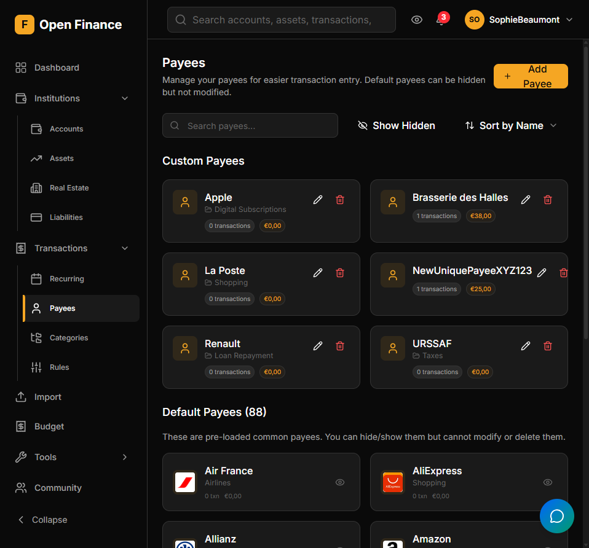

# Payee Management

← [Wiki Home](HOME.md)

---

## Overview

The payee registry stores the merchants, individuals, and organisations involved in your transactions. Assigning payees enables per-payee spending analysis, logo display, and automatic category assignment.

---

## Payee Fields

| Field            | Notes                                                         |
| ---------------- | ------------------------------------------------------------- |
| Name             | Display name (e.g., “Amazon”, “Dr. Smith”)                    |
| Default Category | Auto-applied to new transactions matched to this payee        |
| Logo             | Resolved automatically from the payee name; can be overridden |
| Notes            | Free-text notes                                               |

---

## Automatic Payee Matching

When a transaction is created or imported, Open-Finance attempts to match the transaction description against known payees using fuzzy name matching. If a match is found:

1. The payee is assigned to the transaction.
2. If the payee has a default category and the transaction has no category yet, the default category is applied.

Transaction Rules are evaluated first; payee matching applies as a fallback. See [Transaction Rules](transaction-rules.md).

---

## Payee Logos

Logos for common merchants are resolved automatically from the payee name. You can set or override a logo manually from the payee detail page.

---

## Per-Payee Transaction History

Navigating to a payee shows:

- All transactions linked to that payee
- Total spent or received
- Average transaction amount
- Most recent transaction date

---

## Related Pages

- [Transactions](transactions.md)
- [Categories](categories.md)
- [Transaction Rules](transaction-rules.md)
