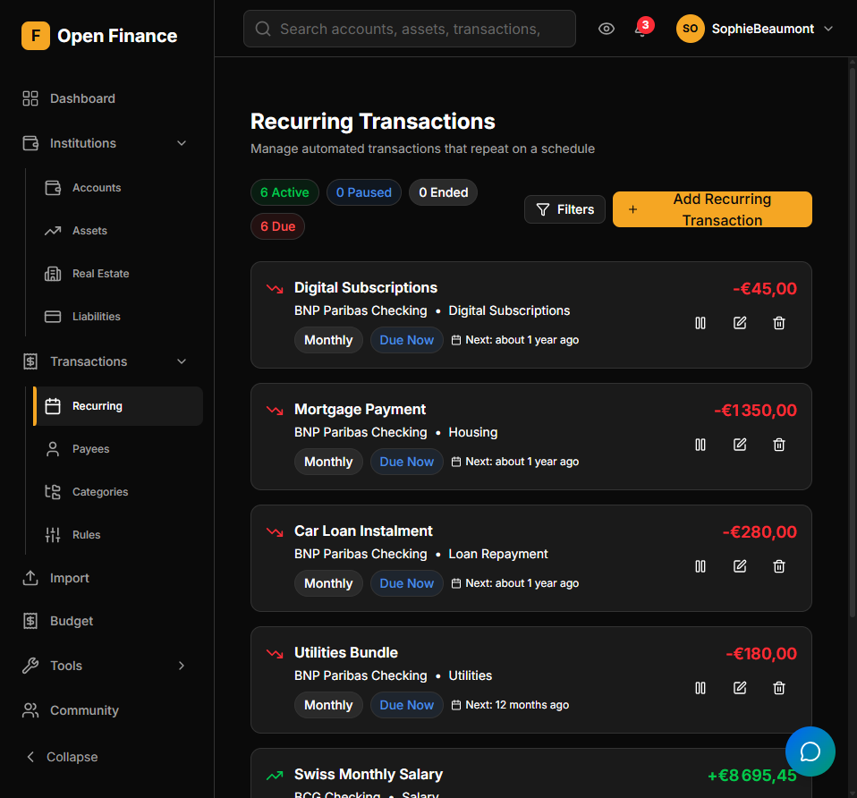

# Recurring Transactions

← [Wiki Home](HOME.md)

---

## Overview

Recurring transactions model predictable income or expenses that repeat on a regular schedule — rent, salaries, subscriptions, loan repayments, standing orders. Open-Finance generates the actual transaction records automatically when each occurrence falls due.

---

## Supported Frequencies

| Frequency     | Description                          |
| ------------- | ------------------------------------ |
| Daily         | Every day                            |
| Weekly        | Once a week on the specified weekday |
| Bi-weekly     | Every two weeks                      |
| Monthly       | Same day each month                  |
| Quarterly     | Every three months                   |
| Semi-annually | Every six months                     |
| Annually      | Once per year                        |

---

## Fields

| Field      | Notes                                           |
| ---------- | ----------------------------------------------- |
| Name       | A label for this rule (e.g., “Netflix”)         |
| Amount     | The transaction amount                          |
| Type       | Income or Expense                               |
| Frequency  | How often the transaction repeats               |
| Start Date | Date of the first occurrence                    |
| End Date   | Optional; the rule is disabled after this date  |
| Account    | Account that receives the generated transaction |
| Category   | Applied to each generated transaction           |
| Payee      | Applied to each generated transaction           |
| Notes      | Copied to each generated transaction            |

---

## How Generation Works

Open-Finance automatically checks daily for due recurring transactions and creates the corresponding records. If the application was briefly offline, any missed occurrences within a catch-up window are retroactively generated so nothing is skipped.

---

## Pausing and Stopping

- **Pause:** set an end date before today, or disable the rule from the recurring transaction’s detail page.
- **Resume:** clear the end date or re-enable the rule.
- **Delete:** removes the rule, but all previously generated transactions are kept.

---

## Attachments

You can attach documents to a recurring transaction rule — for example, a recurring invoice template or contract.

---

## Related Pages

- [Transactions](transactions.md)
- [Categories](categories.md)
- [Accounts](accounts.md)
